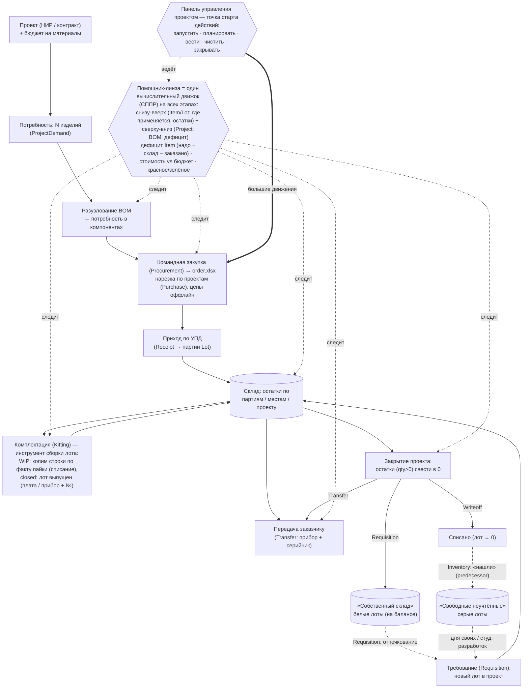

# Plume

Веб-приложение для управления жизненным циклом изделий (PLM) — для небольших
студенческих и научных команд, которые ведут НИР и мелкосерийное производство.

Идея: проект ограничен во времени (НИР на разработку изделия или контракт на
выпуск конкретного количества). PLM избавляет от ручного заполнения актов
комплектации и даёт ответ на вопросы: **сколько каких компонентов осталось, по
какому проекту они куплены, хватает ли их на сборку изделия и что делать с
остатками при закрытии проекта.**

## Возможности (MVP)

- Единый справочник номенклатуры (изделия и компоненты) и состав изделия (BOM).
- Закупки и приход по УПД, склад с учётом партий и мест хранения (ledger).
- Заказ под заданное количество изделий: разузлование BOM, расчёт дефицита
  (надо − склад − заказано) и экспорт `order.xlsx` для поставщиков.
- Акты комплектации образцов (автоматическое списание по BOM).
- Проекты со сквозным потоком: закупки → комплектация → передача → сверка
  балансов и решение по остаткам.

## Стек

Django + Django REST Framework · React + TypeScript (Vite) · MySQL/MariaDB.
Рассчитано на shared-хостинг (напр. reg.ru): без Celery/Redis, тяжёлые операции
синхронно, периодика через cron.

## Быстрый старт

> ⚠️ В разработке — раздел будет дополнен, когда сложится рабочая сборка.

```
# backend
# frontend
```

## Модель данных

> Эти диаграммы — источник правды по модели. Любое изменение схемы БД должно
> сразу отражаться здесь.

### Продуктовая схема (как это работает)



### Техническая схема (структура БД)

```mermaid
erDiagram
  ITEM ||--o{ BOMLINE : "как parent"
  ITEM ||--o{ BOMLINE : "как component"
  ITEM ||--o{ LOT : "партии"
  ITEM ||--o{ PURCHASELINE : ""
  ITEM ||--o{ PROCUREMENTLINE : ""
  ITEM ||--o{ PROJECTDEMAND : "target"
  ITEM ||--o{ KITTING : "target"
  ITEM ||--o{ KITTINGLINE : "component"

  SUPPLIER ||--o{ RECEIPT : ""

  LOCATION ||--o{ STOCKMOVEMENT : ""
  LOCATION ||--o{ KITTINGLINE : ""

  USER ||--o{ PROCUREMENT : "автор"
  USER ||--o{ PURCHASE : "автор"
  USER ||--o{ RECEIPT : "автор"
  USER ||--o{ KITTING : "автор"
  USER ||--o{ TRANSFER : "автор"
  USER ||--o{ INVENTORY : "автор"
  USER ||--o{ WRITEOFF : "автор"
  USER ||--o{ REQUISITION : "автор"
  USER ||--o{ ATTACHMENT : "загрузил"

  LOT ||--o{ STOCKMOVEMENT : ""
  LOT ||--o{ KITTINGLINE : ""
  LOT ||--o{ TRANSFERLINE : ""
  LOT ||--o{ WRITEOFFLINE : ""
  LOT ||--o{ REQUISITIONLINE : "source"
  LOT ||--o{ LOT : "predecessor (закрытие/отпочкование)"

  PROJECT ||--o{ PROJECTDEMAND : ""
  PROJECT ||--o{ LOT : "home (проект лота)"
  PROJECT ||--o{ PURCHASE : ""
  PROJECT ||--o{ RECEIPT : ""
  PROJECT ||--o{ KITTING : ""
  PROJECT ||--o{ TRANSFER : ""
  PROJECT ||--o{ INVENTORY : ""
  PROJECT ||--o{ WRITEOFF : ""
  PROJECT ||--o{ REQUISITION : "получатель"

  PROCUREMENT ||--o{ PROCUREMENTLINE : ""
  PROCUREMENT ||--o{ PURCHASE : ""
  PURCHASE ||--o{ PURCHASELINE : ""
  PURCHASE ||--o{ RECEIPT : "nullable"
  RECEIPT ||--o{ LOT : "создаёт партии (поставка)"
  KITTING ||--o{ KITTINGLINE : ""
  KITTING ||--o{ LOT : "изготовление"
  TRANSFER ||--o{ TRANSFERLINE : ""
  INVENTORY ||--o{ LOT : "найденные партии"
  WRITEOFF ||--o{ WRITEOFFLINE : ""
  REQUISITION ||--o{ REQUISITIONLINE : ""
  REQUISITION ||--o{ LOT : "отпочкованные партии"
  LOCATION ||--o{ WRITEOFFLINE : ""
  LOCATION ||--o{ REQUISITIONLINE : ""

  ITEM ||--o{ ATTACHMENT : "datasheet"
  RECEIPT ||--o{ ATTACHMENT : "скан УПД"
  TRANSFER ||--o{ ATTACHMENT : "скан накладной"
  KITTING ||--o{ ATTACHMENT : "скан акта"
  INVENTORY ||--o{ ATTACHMENT : "скан акта"
  WRITEOFF ||--o{ ATTACHMENT : "скан акта"
  REQUISITION ||--o{ ATTACHMENT : "скан акта"

  ITEM {
    int id PK
    string code "артикул, uniq"
    string name
    string kind "изделие/компонент/материал"
    string uom "ед. изм."
    decimal estimated_cost "оценочная стоимость, руками (nullable)"
    bool is_manufactured
    bool active
  }
  BOMLINE {
    int id PK
    int parent_id FK
    int component_id FK
    decimal qty
    string position "опц."
  }
  SUPPLIER {
    int id PK
    string name
    string inn
  }
  USER {
    int id PK
    string username
    string full_name
    bool is_active "деактивация вместо удаления (PROTECT)"
  }
  LOCATION {
    int id PK
    string code
    string name
    string kind
  }
  LOT {
    int id PK
    int item_id FK
    int project_id FK "home-проект (immutable)"
    int receipt_id FK "origin: поставка (nullable)"
    int kitting_id FK "origin: изготовление (nullable)"
    int inventory_id FK "origin: инвентаризация (nullable)"
    int requisition_id FK "origin: требование/отпочкование (nullable)"
    int predecessor_id FK "лот-предшественник при закрытии (nullable)"
    decimal unit_cost "цена закупки / себестоимость (снимок)"
    string received_name "название из УПД"
    string serial_number "заводской № (nullable, ручной текст)"
  }
  STOCKMOVEMENT {
    int id PK
    int lot_id FK "item и project выводятся из партии"
    int location_id FK
    string type "RECEIPT/ISSUE/RETURN/TRANSFER/ADJUSTMENT"
    decimal qty "со знаком"
    string source_type "УПД/акт/передача (обязателен)"
    int source_id "автор и дата — из документа"
    datetime created_at "технический штамп вставки"
  }
  PROJECT {
    int id PK
    string code
    string name
    decimal budget "бюджет на материалы"
    string kind "внешний НИР/контракт | внутр. склад (белые) | внутр. списано (серые)"
    string status
    date started_at
    date closed_at "nullable"
  }
  PROJECTDEMAND {
    int id PK
    int project_id FK
    int target_item_id FK
    decimal qty
  }
  PROCUREMENT {
    int id PK
    int user_id FK "автор"
    string status "draft/sent/cancelled"
    date date "начало переговоров"
    string note
  }
  PROCUREMENTLINE {
    int id PK
    int procurement_id FK
    int item_id FK
    decimal qty "общее заказываемое (нарезается в PurchaseLine)"
  }
  PURCHASE {
    int id PK
    int procurement_id FK
    int project_id FK
    int user_id FK "автор"
    string status "draft/sent/partial/received/cancelled"
    date date "подписание / оформление"
    string note
  }
  PURCHASELINE {
    int id PK
    int purchase_id FK
    int item_id FK "uniq в рамках закупки"
    decimal qty "заказано"
  }
  RECEIPT {
    int id PK
    string number "УПД №"
    date date
    int supplier_id FK
    int purchase_id FK "nullable"
    int project_id FK
    int user_id FK "автор"
    bool approved "замок: всё сверено со сканом (ручной)"
  }
  KITTING {
    int id PK
    int project_id FK
    int target_item_id FK
    int user_id FK "автор"
    decimal qty "кол-во образцов"
    date date "дата открытия акта"
    string status "wip/closed/cancelled (инструмент ведения сборки лота)"
  }
  KITTINGLINE {
    int id PK
    int kitting_id FK
    int component_id FK
    int lot_id FK
    int location_id FK
    decimal qty
    date date "когда фактически интегрировали/спаяли (nullable)"
  }
  TRANSFER {
    int id PK
    int project_id FK
    int user_id FK "автор"
    date date
    string number "накладная №"
  }
  TRANSFERLINE {
    int id PK
    int transfer_id FK
    int lot_id FK "item выводится из партии"
    decimal qty
    string display_name "переопределяет received_name (nullable)"
  }
  INVENTORY {
    int id PK
    int project_id FK
    int user_id FK "автор"
    string number "акт инвентаризации №"
    date date
    string note
  }
  WRITEOFF {
    int id PK
    int project_id FK
    int user_id FK "автор"
    string number "акт списания №"
    date date
    string reason "причина"
  }
  WRITEOFFLINE {
    int id PK
    int writeoff_id FK
    int lot_id FK
    int location_id FK
    decimal qty
  }
  REQUISITION {
    int id PK
    int project_id FK "проект-получатель новых лотов"
    int user_id FK "автор"
    string number "требование №"
    date date
  }
  REQUISITIONLINE {
    int id PK
    int requisition_id FK
    int source_lot_id FK "откуда отпочковываем (project иной)"
    int location_id FK
    decimal qty
  }
  ATTACHMENT {
    int id PK
    string file "путь в MEDIA_ROOT (файл на диске, не BLOB)"
    string filename "оригинальное имя для скачивания"
    int size "байт"
    string content_type "application/pdf | image/jpeg | image/png"
    string label "опц. подпись (nullable)"
    datetime uploaded_at
    int user_id FK "кто загрузил"
    int item_id FK "владелец: datasheet (nullable)"
    int receipt_id FK "владелец: скан УПД (nullable)"
    int transfer_id FK "владелец: скан накладной (nullable)"
    int kitting_id FK "владелец: скан акта (nullable)"
    int inventory_id FK "владелец: скан акта (nullable)"
    int writeoff_id FK "владелец: скан акта (nullable)"
    int requisition_id FK "владелец: скан акта (nullable)"
  }
```



### Как читать схему — три центра тяжести

Техническая схема естественно кластеризуется вокруг трёх «центров тяжести»:

- **`Item` — разруливание закупок.** Вокруг номенклатуры и BOM вьётся плановый
  контур: `Procurement` / `Purchase` (что и сколько заказать) и потребность
  (`ProjectDemand`). Отвечает на «что нужно купить».
- **`Lot` — склад, движения и комплектация.** Главная учётная единица: вокруг неё
  `StockMovement` (проекция остатков) и все складские документы — `Kitting` /
  `Transfer` / `Writeoff` / `Requisition` / `Inventory` с их строками. Отвечает на
  «что физически есть и куда движется».
- **`Attachment` рядом с `User` — оффлайн-факты.** Сканы документов и datasheet'ы
  плюс авторство (`user` на всех документах). Отвечает на «чем подтверждено и кто
  отвечает».

## Ключевые принципы модели

- **Единый `Item`**: изделия и компоненты — одна сущность; изделие может состоять
  из изделий (рекурсивный BOM через `BomLine`).
- **`Lot` — главная учётная единица.** Хранит цену закупки (`unit_cost`) и
  название из УПД (`received_name`); поставщик и дата берутся через `Receipt`.
  Каждый приход = новый `Lot` (заказы уникальны), отдельной строки документа нет.
- **`Lot` не возникает «из воздуха» — всегда есть origin-документ:** поставка
  (`Receipt`), изготовление (`Kitting`), инвентаризация (`Inventory` — «найденные»
  партии) или отпочкование (`Requisition` — новый лот, отделённый от исходного).
  **Ровно один origin задан** (инвариант — через `clean()`/констрейнт); явные FK по
  типу (FK-целостность + удобные join'ы для покрытия закупки и генеалогии).
- **Комплектация (`Kitting`) — инструмент ведения сборки лота, не атомарный акт.**
  Это главная работа, ради неё всё. Акт живёт в статусе `wip` и **копится по ходу
  проекта**: строка `KittingLine` добавляется по факту физической интеграции
  (пайки), несёт свою `date` (история сборки) и **сразу постит движение** (`ISSUE`
  компонента, бизнес-дата = `KittingLine.date`) в ledger — так комплектацию
  фиксируем по ходу, а не вспоминаем в конце, когда приборы уже уехали. Лот прибора
  «красный», пока акт открыт; при переводе в `closed` рождается `Lot` прибора
  (`+RECEIPT`-движение) — «закрыт» в смысле «сделано всё, что можно», не «отменён»
  (для брошенных — `cancelled`). Строки и движения `wip`-акта провизорны и
  правятся/удаляются, **пока акт не `closed`**; после — только компенсирующим
  `RETURN`.
- **Себестоимость произведённого лота (`unit_cost`) — снимок.** При закрытии
  `Kitting` поле префиллится суммой `Σ (line.qty × component_lot.unit_cost)`
  (один уровень — у детей свой `unit_cost` уже накоплен), дальше живёт статично и
  правится руками (добавить стоимость работ, посчитанную оффлайн). Пересчёт —
  ручная кнопка-помощник «обновить по акту изготовления» (однопроходная, на
  движке разузлования): осознанное действие, **затирает** ручную наценку, поэтому
  показывает дифф и предупреждает о компонентах без цены. Автопересчёта нет;
  стоимость всплывает снизу вверх через снимки. В UI подсвечивается расхождение
  снимка с текущей суммой лотов комплектации — видно, когда стоит нажать «обновить»
  (под капотом ничего тихо не меняем, кнопка остаётся явной). Для покупных лотов
  цена ручная (из счёта). Живой отчёт «себестоимость по материалам» при желании строится поверх
  ledger как проверка, не подменяя снимок.
- **Заводской номер (`Lot.serial_number`)** — ручной текст, не ключ, nullable.
  Присваивается только конечным изделиям (приборам), которые мы производим;
  промежуточные партии (например, батч печатных плат) — без номера. Норма —
  «серийник = экземпляр» (`Lot` на один прибор), но поле текстовое: при
  необходимости один `Lot` несёт диапазон («05–25»). Один акт изготовления может
  породить как 30 партий-приборов (по номеру на каждую), так и одну партию на 30 —
  документооборот выбирается по месту. **Генеалогия прибора («паспорт»)
  выводится разузлованием цепочки** `Lot →(origin) Kitting →(lines) Lot → …`
  (тот же движок, что и BOM); отдельной сущности под это нет.
- **Склад — мутабельные документы + пересчитываемая проекция (`StockMovement`).**
  Источник правды — сами документы (УПД/акты), их строки правятся, пока объект не
  «заморожен»; `StockMovement` **не правят руками** — он пересчитывается из
  документов синхронно при их изменении (данных мало, без Celery), поэтому может
  «плыть» по количествам по ходу подбивки. Двигается **только по `Lot`** (`item` и
  `project` выводятся из партии); остаток = сумма движений в разрезе партии / места /
  проекта. **Движение не существует без документа** (`source_type` + `source_id`
  обязательны): приход (УПД), акт, передача.
- **ДНК мутабельная + мягкий замок (agile «red → green»).** Команда идёт кругами
  «подбивки» проекта (приборы готовы, компонентов хватило, документы сошлись со
  сканами) — и почти всё правится, **пока не сошлось**; «закрытие» — не разрушительная
  запись, а **поле-замок**, которое в формах гасит редактирование, когда всё уже
  сведено. Замки: `Kitting.status=closed` (сделано всё, что можно — не «отменён»;
  `cancelled` — брошенный), `Project.status=closed`, `Receipt.approved` (всё сверено
  со сканом — ручной флаг уверенности, **к проекту не привязан**). Лот «заморожен»,
  когда закрыт его проект или origin-акт — отдельных полей не плодим. Сам замок
  **свободно отжимается** (закрыл по ошибке — отожми, поправь, закрой снова): он не
  морозит мутабельную ДНК, а в первую очередь сигналит «документ проверен» и служит
  ручкой подбивки. **Переоткрытие
  листа цепочки** (вниз на него никто не ссылается) — свободно, тасуй лоты, движения
  пересчитаются; **узла с потомками** (лот уже потреблён / передан / закрыт ниже) — с
  предупреждением «поедут N зависимых» (осознанность, не запрет).
- **Авторство — на документах, не на движении.** Документы редки и всегда
  заведены сотрудником, поэтому автор и дата берутся из документа, а не дублируются
  в движении. `user` (→ аккаунт `User`, колонка `user_id`) есть у всех документов
  (`Procurement`/`Purchase`/`Receipt`/`Kitting`/`Transfer`/`Inventory`/`Writeoff`/
  `Requisition`) —
  личная ответственность за учёт. Пользователей деактивируем (`is_active`), не
  удаляем (`on_delete=PROTECT`). Физически `User` — стандартная Django-модель
  (`auth_user`); зарезервировано лишь голое `USER`, а имя таблицы и колонка
  `user_id` не конфликтуют.
- **Передача — только по `Lot`** (`Transfer` + `TransferLine`): отдаём заказчику
  готовое железо, `item` выводится из партии. Так передача конкретного прибора
  однозначно тянет его заводской номер, а движение фиксируется в ledger
  (`StockMovement`, `source=передача`). Строка передачи допускает `qty > 1` и
  своё `display_name` (переопределяет `received_name` в накладной — напр. «Прибор
  X. Заводские номера 05–25»). КД и прочий документооборот — оффлайн, вне PLM.
- **Проект — свойство лота (`Lot.project`), не движения.** Лот живёт в одном
  проекте от рождения (origin-документ) до закрытия; `movement.project` выводится
  из лота, межпроектного переноса одного лота не бывает. `project` обязателен на
  документах — «общего через `NULL`» больше нет, его заменяют **внутренние
  проекты** (`Project.kind`): «Собственный склад» (белые, на балансе) и «Свободные
  неучтённые компоненты» (серые, списанные).
- **Отпочкование лота (`Requisition` = требование).** Комплектование из
  «Собственного склада» в проект — это не перетег `project`, а **отделение**:
  `−qty` (ISSUE) на исходном лоте (живёт дальше) + рождение **нового лота** в
  проекте-получателе (`origin=Requisition`, `predecessor=исходный лот`, qty
  сохраняется). Обычно выписывают ровно сколько надо → исходный лот уходит в ноль
  (для этого и нужен «Собственный склад» — не копить мелкие остаточные лоты).
  «Постановка на баланс» при закрытии — тот же документ в обратную сторону (лот
  проекта → новый белый лот).
- **Закрытие проекта — закрывающими документами, не правкой.** Каждый невыбранный
  лот (`qty>0`) сводится в 0: передачей заказчику (`Transfer`), списанием
  (`Writeoff`) или постановкой на баланс (`Requisition` → «Собственный склад»).
  Серый путь = `Writeoff` (списали с проекта) → позже `Inventory` («нашли» как
  неучтённое) с `predecessor` на списанный лот. Команда работает спринтами:
  «обнуляется» в конце проекта, но не теряет контроль над остатками (белые/серые).
- **Закупки — два уровня: `Procurement` → `Purchase`.** `Procurement` = один поток
  общения с одним контрагентом (одна командная закупка = один `order.xlsx`), может
  охватывать несколько проектов; поставщик и цены — по-прежнему оффлайн.
  `ProcurementLine` (что заказываем у поставщика, итог) **нарезается по проектам** в
  `PurchaseLine` (`Σ PurchaseLine.qty по item = ProcurementLine.qty`, инвариант
  мягкий — предупреждаем о расхождении), так одна физическая поставка ложится на
  нужные ФЛС: 20 приборов на 5 проектов (6/6/6/1/1) = 5 `Purchase` → 5 УПД → 5
  наборов лотов. Случай 1:1 (один проект — один поставщик, частый) сворачивается в
  один `Purchase` без лишних кликов. `Purchase` — проектный документ со своим
  `status` (`draft/sent/partial/received/cancelled`), автором и датами (начало
  переговоров / подписание): каждый кусок застревает на согласовании сам по себе;
  `Procurement.status` (`draft/sent/cancelled`) — состояние всего потока. Закупка
  «разрешается» в приходы: `PurchaseLine` закрывается одним/несколькими `Lot` через
  `Lot → Receipt → Purchase` (поставка 100 = 60 + 40 — норма); привязка партии к
  строке по `(purchase, item)`, поэтому пара `(purchase, item)` уникальна.
- **Бюджет и помощник-линза.** У `Project` есть `budget` (деньги на материалы =
  ФЛС проекта, отдельной сущности не заводим), у `Item` — `estimated_cost`
  (оценочная стоимость, руками, по мере сбора КП). **Помощник-линза — не таблица, а
  сквозная вычисляемая проекция** по всем проектам сразу: красит строки BOM
  красным (надо купить) / оранжевым (заказано или делается) / зелёным (лот уже
  есть), считает дефицит и его стоимость
  (`Σ дефицит × estimated_cost`) против `budget` (план профицита/дефицита денег),
  подсвечивает профицит на «Собственном складе» и **предлагает** закрыть его через
  `Requisition` (подтверждаешь руками). Бюджет-отчёт двусторонний: **планируемый**
  (открытые строки — по `estimated_cost`, закрытые — по факту УПД) и **фактический**
  (строго `Lot.unit_cost × qty`, что уже точно потрачено).
  - **Один вычислительный движок на всю линзу** (набор чистых функций-проекций над
    документами, не дублируется по формам — иначе числа разъезжаются). Линза —
    **система поддержки принятия решений**: переносит экспертные функции из головы
    предметника в детерминированный движок над БД (что заказать? в каком количестве?
    успеваем? закрываемся?). Оффлайн-факт (цены/КП/сканы) ложится на тот же движок
    как входные данные.
  - **Дуальность направления — две проекции одного движка**, общий словарь статусов
    (`▲`/`✓`): **снизу вверх** для `Item`/`Lot` (где применяется, кому и сколько
    нужно, остатки по проектам) и **сверху вниз** для `Project` (разузлование BOM,
    красные/зелёные строки, дефицит, бюджет). Тот же движок аккуратно следит за
    целостностью таблиц.
  - **Все проекции read-only в представлении** — это подсказка пользователю: менять
    надо не в линзе, а в документе, который отражает факт.
  - **Лот терминирует разузлование** — лот воплощает своих детей, поэтому в дефиците
    это одна строка, вглубь не раскрываем (иначе двойной счёт: понадобятся и
    компоненты, и собранный из них узел). Спускаемся только по тому, чего нет лотом,
    останавливаясь на лотах (в т.ч. частичных — wip-`Kitting`) и листьях BOM;
    самоподобно по уровням сборки. **Две разные разузлования, не путать:** BOM-разузел
    (план, `item → BomLine → item`) и генеалогия (факт, `Lot → Kitting → Lot`,
    «паспорт» прибора, всегда полная глубина).
  - **Глубина — по цели формы:** дашборд — динамическая «по красному» (терминируя на
    лотах); форма-`Kitting` — ровно один уровень BOM (плата = атом, её состав — в её
    акте); паспорт — полная по фактам; where-used — вверх по применяемости.
  - **wip-`Kitting` закрывает счётчик потребности прибора, но не остаток его BOM.**
    Спрос на прибор в трёх корзинах: **готово** (закрытый лот, `✓`) / **делается**
    (wip-`Kitting`, `●`) / **не начато** (потребность − закрытые − wip, `▲`). Дефицит
    компонентов = разузел «не начатых» + Σ остаток wip-`Kitting` (`BOM target − уже
    пробитые KittingLine`); так уже впаянные компоненты (лоты просели) не
    заказываются повторно.
  - **Цвет прибора = worst-of строк + бейдж прогресса.** Есть красная (незаказанная)
    строка → прибор **красный** (нужна работа), но бейдж показывает лучший достигнутый
    статус («движемся, просто тупим»). Прибор оранжевеет, лишь когда красного не
    осталось — всё критичное, зависящее только от команды, сделано (дальше —
    контрагенты и обстоятельства). Жизненный цикл строки — конвейер: `▲` не заказан →
    `●` заказан/делается (ждём) → `✓` лот доступен/потреблён.
  - **Форма-`Kitting` = кокпит сборки** (та же линза, спроецированная на акт):
    пробитые `KittingLine` — реальные строки, непробитые строки BOM — **призрачные**
    (read-only, покрашены по доступности компонента). Пайка = «промоушн» призрака в
    реальную `KittingLine`; отдельного хранения у призраков нет (это проекция).
  - **«Склад» в дефиците = лоты своего проекта** (`lot.project == project`, по живому
    `qty`), резервов нет: лот доступен, пока по нему не пробита `KittingLine` (пробитое
    физически назад не выпаиваем). Остаток **может быть отрицательным** — показываем как
    есть (недостача информативнее нуля) и метим аномалией «подбей лоты», не клампим.
    Внутренние проекты (белый/серый) в зачёт своего проекта **не идут** — это отдельные
    склады.
- **Два дашборда — две высоты одного движка.** **Командный** (по всем проектам, ось
  Item) даёт плоский роллап дефицита по номенклатуре и ведёт в `Procurement`
  (`Procurement` без `project` — маркер командной высоты, а не пробел): команда
  консолидирует «что закупить сейчас». **Проектный** (ось Project) ведёт в `Purchase`
  и жизненный цикл проекта. Командный дефицит = **Σ проектных дефицитов по Item**, а не
  перенеттинг в общий котёл (чужие ФЛС/деньги); «Собственный склад» остаётся
  **предложением** через `Requisition`, не авто-зачётом. **Pegging** (разворот строки
  роллапа «откуда сложилось число») — один механизм на три работы: проверка глазами,
  нарезка заказа по контрагенту (чек-бокс по узлам BOM → «сформировать закупку») и
  авто-срез консолидированного `Procurement` обратно в проектные `Purchase`. Запас % и
  ручной override (заказ кратно 1000 при дефиците 194) ложатся в `ProcurementLine.qty`
  (документ), расчёт движка остаётся проекцией. Панель управления проектом — главная
  точка старта действий, та, что **ведёт**: отсюда запускаются автоматизированные
  «большие движения», затем дотачиваются руками в мутабельных строках документов.
  Этапы управления:
  **запустить** (завести `budget`) → **планировать потребность** (`ProjectDemand`,
  N приборов) → **планировать закупку** (заполнить `Purchase`, перевести в заказ) →
  **вести** (получать `Lot` по УПД, комплектовать `Kitting`) → **чистить** (подбивать
  лоты по актам) → **закрывать** (свести остатки в 0 и поставить замок на связанные
  документы). Закрытие наступает **само** как итог аккуратного управления, а не как
  отдельная разрушительная операция.
- **Консолидация = проекция, изоляция = хранение** (сквозной принцип линзы). Роллап,
  серая куча, `Procurement` — это проекции «свести вместе»; `Lot`, `Purchase`,
  `Kitting` и закрывающие акты — по-проектно, атомарно, врозь. Слить запросом можно в
  любой момент, разорвать слитое — нельзя, поэтому слияний в хранении не делаем.
  `Procurement` нарезается в `Purchase` начисто (проектные доли круглые, их сумма =
  командная закупка); запас держим по-проектно, не общим котлом, а «194 в 0 без
  запаса» = честный сигнал связи производств (не прячем и не наводим искусственно).
  Излишки выводятся из проекта отдельными по-проектными актами при закрытии —
  изоляция документооборота по проекту это умение, а не побочка. **Партия N приборов
  на M проектов = строго M актов `Kitting`** (партия — оффлайн-группировка, не
  сущность; связь актов в модели не вводим).
- **Единый вид склада.** Любой склад — проектный, «Собственный» (белый, через
  `Requisition`, лоты видим раздельно) или «Свободные неучтённые» (серый, через
  `Writeoff`, обычно показываем суммой) — представляется **свёрнутым по Item
  аккордеоном** с общим числом; детализация лотов (из каких приходов стеклось,
  провенанс по `Lot.predecessor` → `Receipt` → УПД) — по явному запросу. Спец-правил
  на тип склада не вводим: единообразие форм важнее.
- **Карта остатков по складам-проектам (нижне-восходящая проекция, north-star).**
  Каждый проект — это склад; при решении «что закупить» движок показывает, **где этот
  Item уже лежит по всем складам-проектам** (включая белый и серый — все равноправны) с
  доступным `qty`. Это переносит знание «у кого что есть» из головы в БД — главная боль,
  ради которой затевался PLM. **Авто-зачёта между проектами нет:** человек выбирает
  диспозицию, движок предлагает соответствующий акт — заказать новое
  (`Procurement`/`PurchaseLine`), взять с белого (`Requisition`), спаять из своего
  (прямая `KittingLine`) или обоснованно заимствовать у соседнего активного проекта
  (`Requisition` B→A). Заём = **явный документ**: у источника `qty` просядет, его дефицит
  честно пересчитается. Порядок-подсказка (белый → этот проект → соседние → серый) —
  мягкая сортировка, не жёсткий ранг.
- **Вложения (`Attachment`) — единая таблица, файлы на диске.** Файлы у любого
  `Item` (datasheet'ы покупных; чертежи/спецификации производимых) и сканы
  подписанных документов (`Receipt`/`Transfer`/`Kitting`/`Inventory`/`Writeoff`/
  `Requisition`) — один файл = одна строка `Attachment`,
  владелец 1:N. Сам файл лежит на диске (`FileField` → `MEDIA_ROOT`), **не BLOB в
  БД** (иначе раздувание дампов и упор в `max_allowed_packet` на shared-MySQL); в
  таблице — путь, имя, размер, `content_type` (PDF / JPEG / PNG), автор загрузки
  (`user`) и дата. Связь с владельцем — **тот же приём «exclusive arc», что у
  origin `Lot`**: семь nullable-FK (`item`/`receipt`/`transfer`/`kitting`/
  `inventory`/`writeoff`/`requisition`), из которых **задан ровно один** (инвариант
  через `CheckConstraint` в БД + `clean()` для понятной ошибки в форме). Выбран ради
  настоящей FK-целостности и каскадного удаления — против `GenericForeignKey`
  (теряет и то, и другое). Поля «тип файла» нет: datasheet это или скан — ясно из
  контекста формы-владельца. Удаление владельца — `on_delete=CASCADE` + физическое
  удаление файла с диска (форма переспрашивает и предупреждает, что файлы тоже
  уйдут): доверяем пользователю, лишний повторный дроп лучше осиротевшего мусора на
  диске.
- **«Что ещё не заказано» и сверка балансов — отчёты поверх ledger**, а не
  отдельные мутабельные таблицы:
  `ещё заказать = надо (BOM×потребность) − склад (Lot) − заказано (открытые PurchaseLine)`.

## Лицензия

См. [LICENSE](LICENSE).
